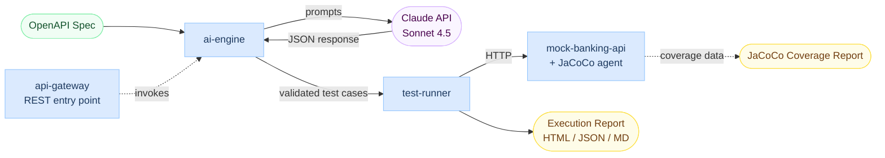

# TestForge AI

AI-powered API test generation platform. Java 21 + Spring Boot + Anthropic Claude.

## What It Does

Reads an OpenAPI 3.0 specification, generates structured test cases using Anthropic Claude, then executes them against the live API and produces structured execution reports.

Pipeline: OpenAPI YAML -> AI Engine (Claude) -> List<TestCase> -> Test Runner -> ExecutionReport (JSON + Markdown)

## 📊 Live Demo Report

**[Click here to see a real V3.1 execution report rendered in your browser](https://meiashley.github.io/testforge-ai/sample-execution-report.html)** — generated by real Claude Sonnet 4.5 API output. Shows 9/9 passed test cases with full request/response/assertion details.

## Real Claude Baseline: 100% Pass Rate

V3.1 hits 100% (9/9) against real Anthropic Claude Sonnet 4.5 API. Achieved through 3 iterations of prompt and pipeline design:

| Version | Pass Rate | Key Change |
|---------|-----------|------------|
| V1 | 55.6% (5/9) | Naive baseline prompt |
| V2 | 77.8% (7/9) | + State machine context (+22.2pp) |
| V3 | 88.9% (8/9) | + Fixture lifecycle (+11.1pp) |
| V3.1 | 100% (9/9) | + Per-test lazy fixtures (+11.1pp) |

Total improvement: +44.4pp from V1 baseline.

Detailed iteration story: [docs/v1-to-v3.1-iteration-comparison.md](docs/v1-to-v3.1-iteration-comparison.md)

Real baseline reports for each version under [docs/](docs/).

## Architecture

| Module | Status | Description |
|--------|--------|-------------|
| mock-banking-api | V1 | 3-endpoint payment service (the test target) |
| ai-engine | V3.1 | OpenAPI to Claude prompt to structured TestCases (4 prompt versions) |
| test-runner | V3.1 | HTTP execution + assertion + fixture lifecycle + reporting |
| api-gateway | Planned | REST entry point for the full pipeline |

## Testing

- ai-engine: 18 tests (TDD throughout, 4 prompt builder versions tested)
- test-runner: 24 tests (assertion, HTTP, report, pipeline, fixtures, integration)
- mock-banking-api: 5 controller tests
- Total: 47 tests passing

## Quick Start

git clone https://github.com/meiashley/testforge-ai.git
cd testforge-ai
export ANTHROPIC_API_KEY="sk-ant-..."
mvn install -DskipTests
mvn test -pl test-runner -Dtest=V3BaselinePipelineTest
cat test-runner/target/v3-execution-report.md

## Tech Stack

- Language: Java 21
- Framework: Spring Boot 3.2 (mock service only; library code is plain Java)
- AI: Anthropic Claude API (Sonnet 4.5)
- Test: JUnit 5, RestAssured, WireMock, Spring Boot Test
- Build: Maven 3 (multi-module)
- Other: Jackson, OkHttp, Lombok, swagger-parser

## Engineering Practices

- TDD throughout: every feature has tests written before implementation (RED-GREEN-REFACTOR)
- Spec-driven development: design spec, then implementation plan, then execute
- One variable per iteration: each prompt/pipeline version changes exactly one thing for clean delta attribution
- Real data over mock: all baselines run against real Claude API, all reports reproducible
- Conventional commits: type(scope): subject format throughout
- Strategy Pattern for AI client: MockClaudeClient and RealClaudeClient interchangeable
- YAGNI on abstractions: domain models stay in their owning module until cross-module need is proven
- Backward compatibility: each pipeline version adds method overloads rather than breaking existing signatures

## Iteration Examples

V1 to V2: Added state machine context to prompt
- Problem: Claude assumed POST /payments returned status PENDING
- Reality: API returns COMPLETED immediately
- Fix: Embedded 5 state machine transitions in prompt
- Result: createPayment 2/3 -> 3/3, getPayment 1/3 -> 2/3

V2 to V3: Added fixture lifecycle
- Problem: HAPPY PATH GET/refund hardcoded fake IDs that returned 404
- Reality: Tests need a real existing payment to query/refund
- Fix: SetupRunner creates seed payment, ExecutionPipeline substitutes {{paymentId}} with real ID
- Result: getPayment 2/3 -> 3/3 (hardcoded ID failure resolved)

V3 to V3.1: Per-test lazy fixtures
- Problem: refund BOUNDARY failed because the seed payment was already refunded by an earlier test
- Reality: Tests sharing fixtures pollute each other's state
- Fix: Lazy fixture initialization - each test with placeholders gets a fresh seed
- Result: refundPayment 2/3 -> 3/3, V3.1 hits 100%

## 🏗️ Architecture

End-to-end flow: OpenAPI spec → ai-engine (with spec caching + contract validation) → Claude → validated test cases → test-runner → HTTP execution against mock-banking-api → Execution Report + JaCoCo Coverage. `api-gateway` exposes the full workflow as a REST entry point.

## 🤖 AI Failure Analyzer

When test cases fail, the system batch-analyses them via Claude to diagnose root causes. Each diagnosis includes a category, evidence-based summary, suggested fix, and confidence label.

**Categories**
- `TEST_LOGIC_ERROR` — Test expectations don't match the spec
- `API_BUG` — API behaves incorrectly per the spec
- `DATA_DEPENDENCY` — Required prerequisite data missing or in wrong state
- `ASSERTION_TOO_STRICT` — Assertions check fields not actually required
- `ENVIRONMENT` — Network/timeout/infrastructure issue
- `UNCERTAIN` — Multiple plausible causes; needs human review

**V4 Baseline Diagnosis Results (6 failures, all HIGH confidence)**

| Category               | Count | Example                                                                 |
|------------------------|-------|-------------------------------------------------------------------------|
| `TEST_LOGIC_ERROR`     | 3     | Test expects 201 for over-maxLength input; API correctly returns 400    |
| `ASSERTION_TOO_STRICT` | 2     | Test asserts `code` field on Spring default error response              |
| `API_BUG`              | 1     | **Real bug found**: Refund on already-REFUNDED payment returns 200 instead of 422 |

The analyzer is batch-mode (one Claude call diagnoses all failures), result-cached on input hash (re-runs on the same failures cost $0), and renders as expandable HTML blocks in the execution report alongside each failed case.

## 🎯 Quality Validation

V3.1 AI-generated test suite quality measured on three independent axes:

| Metric                    | Value         | Source                                    |
|---------------------------|---------------|-------------------------------------------|
| Pass rate                 | **100%** (9/9)  | Real Claude Sonnet 4.5 against live API   |
| Line coverage             | **82.6%**     | JaCoCo on `mock-banking-api`              |
| Branch coverage           | **60.0%**     | JaCoCo (Lombok-generated code excluded)   |
| Method coverage           | **80.0%**     | JaCoCo                                    |
| Class coverage            | **87.5%**     | JaCoCo                                    |
| Contract violations       | **0**         | TestCaseContractValidator vs OpenAPI spec |

**[View full JaCoCo coverage report](https://meiashley.github.io/testforge-ai/coverage/index.html)**

### Multi-Layer Validation Strategy

Quality is not measured by pass rate alone. TestForge AI validates AI-generated tests on three layers:

1. **Pre-execution: Contract conformance** — `TestCaseContractValidator` checks every generated test case against the OpenAPI spec (path, method, expected status code, request body fields). Structurally invalid tests are filtered out before execution, with `[contract violation]` log lines for visibility.

2. **Runtime: Pass rate + assertion strictness** — Tests execute against the live API; each assertion (status code, body field, type, structure) must hold for the test to pass.

3. **Post-execution: Code coverage** — JaCoCo measures how thoroughly the passing tests actually exercise the underlying business code. 82.6% line coverage means the tests aren't just structurally passing — they reach into the real logic.

This combination catches three different failure modes:
- ❌ A test that passes by checking nothing meaningful → caught by coverage
- ❌ A test with a wrong path Claude invented → caught by contract validator  
- ❌ A test whose expected status doesn't match reality → caught by execution

### V4 Baseline — Dimension-Driven Generation

V4 removes the V3 "EXACTLY 3 cases" constraint and uses dimension-driven prompts (status codes, happy path, boundary, negative, authorization edge cases) to let Claude generate as many test cases as needed.

| Metric                    | V3.1                | V4                  |
|---------------------------|---------------------|---------------------|
| Test cases generated      | 9 (3 per endpoint)  | **34** (3.8x growth) |
| Pass rate                 | 100%                | **82.4%** (28/34)   |
| Coverage strategy         | Narrow & reliable   | Broad & exploratory |

**[View V4 execution report](https://meiashley.github.io/testforge-ai/sample-v4-execution-report.html)** — failed cases include embedded AI Failure Analyzer diagnoses.

## REST API (api-gateway)

The platform exposes a REST API for asynchronous test generation. Single JVM hosts both the gateway (port 8080) and mock-banking-api endpoints.

### Quick Start

Start the gateway:

    mvn install -DskipTests
    mvn spring-boot:run -pl api-gateway

Submit a test generation job (returns immediately with jobId):

    curl -X POST http://localhost:8080/api/v1/generate-tests \
      -H "Content-Type: application/json" \
      -d '{
        "openApiUrl": "http://localhost:8080/openapi.yaml",
        "promptVersion": "V3.1"
      }'

Response (HTTP 202):

    {
      "jobId": "524d605a-202e-448d-adb8-122679966711",
      "status": "PENDING",
      "statusUrl": "/api/v1/jobs/524d605a-202e-448d-adb8-122679966711"
    }

Poll for results:

    curl http://localhost:8080/api/v1/jobs/{jobId} | python3 -m json.tool

When complete (~30 seconds):

    {
      "jobId": "...",
      "status": "COMPLETED",
      "promptVersion": "V3.1",
      "report": {
        "summary": {
          "total": 9,
          "passed": 7,
          "passRate": 0.7778
        },
        "results": [...]
      }
    }

### Supported Prompt Versions

Pass any of these in the promptVersion field:

- V1 - Naive baseline prompt
- V2 - State machine context (+22pp over V1)
- V3 - Fixture lifecycle (+11pp over V2)
- V3.1 - Per-test lazy fixtures (default, recommended)

### Architecture

Async execution via Spring `@Async` (extracted into `GenerationExecutor` to activate AOP proxy).

Pipeline: REST -> Job (in-memory store) -> ai-engine (Claude API) -> test-runner (HTTP execution + assertions) -> stored ExecutionReport.

### Swagger UI

Built-in via springdoc-openapi: http://localhost:8080/swagger-ui.html

## Roadmap

- [x] V1 baseline + integration test
- [x] V2 prompt with state machine context
- [x] V3 fixture lifecycle
- [x] V3.1 per-test lazy fixtures (100% pass rate)
- [x] V4: Dimension-driven generation (34 cases, 82.4% pass rate)
- [ ] V5: Multi-fixture types and teardown phase
- [x] api-gateway REST entry point (V3.1: 7/9 = 77.8% via real Claude API end-to-end)
- [x] Code coverage validation via JaCoCo (V3.1: 82.6% line, 60% branch on mock-banking-api)
- [x] Contract conformance validator: pre-execution check that AI-generated tests match OpenAPI spec
- [ ] Migrate integration tests to Testcontainers
- [x] AI Failure Analyzer: batch root-cause diagnosis of failed test cases (6 categories, confidence labels, embedded in HTML reports)
- [ ] Mutation testing: inject synthetic API defects to validate test detection power
- [ ] Quality metrics: schema validity, coverage diversity, bug-detection rate

## Design Documents

- [ai-engine V1 Spec](docs/superpowers/specs/2026-05-01-ai-engine-v1-design.md)
- [test-runner V1 Spec](docs/superpowers/specs/2026-05-04-test-runner-v1-design.md)
- [V3 Fixture Lifecycle Spec](docs/superpowers/specs/2026-05-07-v3-fixture-lifecycle-design.md)
- [V1 to V3.1 Iteration Comparison](docs/v1-to-v3.1-iteration-comparison.md)

## License

MIT
