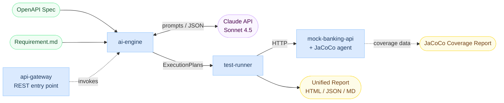

# TestForge AI

> AI-powered test engineering platform that turns OpenAPI specs + business requirements into executable test suites — with consistency checking, multi-step scenarios, and AI-driven failure diagnosis.


---

## 📊 Live Demo Reports

[](https://meiashley.github.io/testforge-ai/sample-v5-execution-report.html)
[](https://meiashley.github.io/testforge-ai/sample-v4-execution-report.html)
[](https://meiashley.github.io/testforge-ai/sample-execution-report.html)
[](https://meiashley.github.io/testforge-ai/coverage/index.html)

🆕 **V5** combines PRD-driven scenarios + AI-augmented API tests + automatic consistency check between requirements and OpenAPI spec.

---

## 🎯 What It Does

Feed in:
- An **OpenAPI specification** (technical contract)
- A **product requirement document** (business intent, Markdown)

The pipeline:
1. Extracts structured business constraints from the requirement
2. Detects inconsistencies between requirement and OpenAPI spec
3. Generates API-level tests + multi-step business scenario tests
4. Executes everything against a real API
5. Uses AI to diagnose root causes of failures

The result is a single unified report covering contract conformance, code coverage, scenario validation, requirement-API alignment, and AI failure analysis.

---

## 🚀 Iteration Story: V1 → V5

| Version | Test Cases | Pass Rate | What It Proves                                                |
|---------|-----------|-----------|---------------------------------------------------------------|
| V1      | 9          | 55.6%     | Naive baseline, exposed state pollution issues                |
| V3.1    | 9          | **100%**  | Per-test lazy fixtures (narrow scope, reliable)               |
| V4      | 34         | 82.4%     | Dimension-driven generation + AI Failure Analyzer (found real API bug) |
| **V5**  | **34 + 6** | 82.4% / 50% | Requirement-driven pipeline + consistency check + multi-step scenarios |

---

## 🌟 Key Highlights

- 🧠 **Requirement-driven test generation** — AI reads PRD Markdown and extracts 26 structured business constraints
- 🔍 **Consistency check** — automatically surfaces 23 mismatches between requirement and OpenAPI (e.g., undocumented ownership rules, missing idempotency)
- 🎬 **Multi-step business scenarios** — generates execution plans like "User A pays, User B attempts refund (should be rejected)"
- 🤖 **AI Failure Diagnoser** — when tests fail, Claude diagnoses root cause across 6 categories (TEST_LOGIC_ERROR / API_BUG / etc.) with confidence labels
- 💰 **Prompt-level caching** — SHA256(model + prompt); 85% time reduction on warm runs ($0.30 → $0)
- 🛡️ **4-layer quality validation** — contract / runtime / coverage / AI diagnosis

---

## 🏗️ Architecture



End-to-end flow: OpenAPI spec + requirement document → ai-engine (with spec caching + contract validation + AI failure analysis) → Claude → ExecutionPlans → test-runner → HTTP execution against mock-banking-api → unified report + JaCoCo coverage. `api-gateway` exposes the full workflow as a REST entry point.

See [docs/architecture.md](docs/architecture.md) for module boundary details.

---

## 🧠 V5 Pipeline

V5 introduces a 6-stage requirement-driven pipeline orchestrated by `QualityPipelineOrchestrator` (pure orchestration, no business logic).

| Stage                      | Component             | What It Does                                                       |
|----------------------------|-----------------------|-------------------------------------------------------------------|
| 1. Requirement understanding | `RequirementAnalyzer` | Extract structured constraints from PRD (value range, state machine, ownership, authorization, workflow) |
| 2. Consistency check       | `ConsistencyChecker`  | Compare requirement vs OpenAPI; surface mismatches with severity + confidence |
| 3. Feature mapping         | `RequirementApiMapper`| Lookup which endpoints serve each business feature                 |
| 4. Workflow design         | `ApiFlowResolver`     | Order endpoints + define `${variable}` data bindings between steps |
| 5. Scenario planning       | `ScenarioPlanner`     | Add business assertions, test data, and expected status codes; produce `ExecutionPlan` |
| 6. Failure diagnosis       | `FailureAnalyzer`     | Batch AI analysis of failed steps (V4 carry-over)                  |

Strict separation of concerns: Mapper finds endpoints, Resolver orders them, Planner adds business logic. Shared state lives in `QualityContext` to prevent parameter sprawl in the orchestrator.

---

## 🤖 AI Failure Analyzer

When tests fail, the system sends a batch request to Claude (one call diagnoses all failures) and gets back structured root causes.

**Categories**
- `TEST_LOGIC_ERROR` — Test expectations don't match the spec
- `API_BUG` — API behaves incorrectly per the spec
- `DATA_DEPENDENCY` — Required prerequisite data missing or in wrong state
- `ASSERTION_TOO_STRICT` — Assertions check fields not actually required
- `ENVIRONMENT` — Network/timeout/infrastructure
- `UNCERTAIN` — Multiple plausible causes; needs human review

**V5 baseline diagnosis breakdown (9 failures analyzed)**

| Category               | Count | Note                                                  |
|------------------------|-------|-------------------------------------------------------|
| `API_BUG`              | **3** | Real defects in `mock-banking-api`                    |
| `TEST_LOGIC_ERROR`     | 5     | AI-generated test expectations not aligning with spec |
| `ASSERTION_TOO_STRICT` | 1     | Assertion checks a field not actually required        |

The AI doesn't just report failures — it flagged **3 real production-relevant defects** in `mock-banking-api`, including the V4-discovered refund idempotency gap (refunding an already-REFUNDED payment returns 200 instead of 422) plus 2 additional bugs surfaced by V5 multi-step scenarios.

Each diagnosis includes: category, summary, evidence (specific data points from response), suggested fix, and confidence label. Results render inline in failed test rows in the HTML report.

---

## 🛡️ Quality Validation

Quality is measured on 4 independent layers — passing rate alone is insufficient.

| Layer                              | What It Catches                                          |
|------------------------------------|----------------------------------------------------------|
| 1. Pre-execution: Contract Validator | Tests with invalid paths, methods, or schemas (blocked before execution) |
| 2. Runtime: Pass rate + assertions | Functional correctness against live API                  |
| 3. Post-execution: JaCoCo Coverage | Whether passing tests actually exercise the code         |
| 4. Post-execution: AI Failure Analyzer | Root-cause categorization of failures (test bug vs API bug) |

### V3.1 Detailed Metrics

| Metric                | Value         |
|-----------------------|---------------|
| Pass rate             | **100%** (9/9) |
| Line coverage         | **82.6%**     |
| Branch coverage       | **60.0%**     |
| Contract violations   | **0**         |

### V4 Detailed Metrics

| Metric              | Value         |
|---------------------|---------------|
| Test cases          | 34 (vs V3.1 9) |
| Pass rate           | 82.4% (28/34) |
| AI diagnoses        | 6 (HIGH confidence) |
| Real bug found      | 1 (refund idempotency) |

### V5 Detailed Metrics

| Metric                       | Value          |
|------------------------------|----------------|
| Constraints extracted        | **26**         |
| Scenarios identified         | 6              |
| Mismatches detected          | **23**         |
| API tests (incl. V4 layer)   | 34 (28 pass)   |
| Multi-step scenarios         | 6 (3 pass)     |
| AI failure diagnoses         | 9              |
| — categorized as             | 3 API_BUG / 5 TEST_LOGIC_ERROR / 1 ASSERTION_TOO_STRICT |

---

## ⚙️ REST API (api-gateway)

The pipeline is exposed as an async REST API for integration into CI/CD.

### Quick Start

```bash
# Start the gateway
mvn spring-boot:run -pl api-gateway

# Submit a generation job
curl -X POST http://localhost:8080/api/test-generations \
  -H "Content-Type: application/json" \
  -d '{"specPath": "/path/to/openapi.yaml", "promptVersion": "v4"}'

# Poll for results
curl http://localhost:8080/api/test-generations/{job-id}
```

Implements an async generation pattern with `GenerationExecutor` + `@Async` and AOP self-invocation handled correctly.

Swagger UI available at `http://localhost:8080/swagger-ui.html` after startup.

---

## 🚀 Quick Start

```bash
# Build everything
mvn install -DskipTests

# Run V3.1 baseline (requires ANTHROPIC_API_KEY env var)
mvn test -pl test-runner -Dtest=V3BaselinePipelineTest

# Run V4 baseline (34 cases, dimension-driven)
mvn test -pl test-runner -Dtest=V4BaselinePipelineTest

# Run V5 pipeline (requirement + API + scenarios)
mvn test -pl test-runner -Dtest=V5BaselinePipelineTest

# View HTML report
open test-runner/target/v5-execution-report.html
```

Prompt-level caching is automatic — re-runs with the same model + prompt are free.

---

## 🗺️ Roadmap

- [x] V1 → V3.1: iterative pass rate improvement
- [x] V4: Dimension-driven generation
- [x] AI Failure Analyzer (batch root-cause diagnosis)
- [x] JaCoCo code coverage integration
- [x] TestCaseContractValidator (pre-execution structural check)
- [x] Architecture diagram + plugin-pattern reporting
- [x] V5: Requirement-driven pipeline + consistency check + scenario execution
- [ ] V6: Requirement-aware API test generation (replace V4 fallback with native V5-style API planner)
- [ ] Mutation testing: inject synthetic API defects to validate test detection power
- [ ] Multi-spec batch processing in CI

---

## 📜 License

MIT
