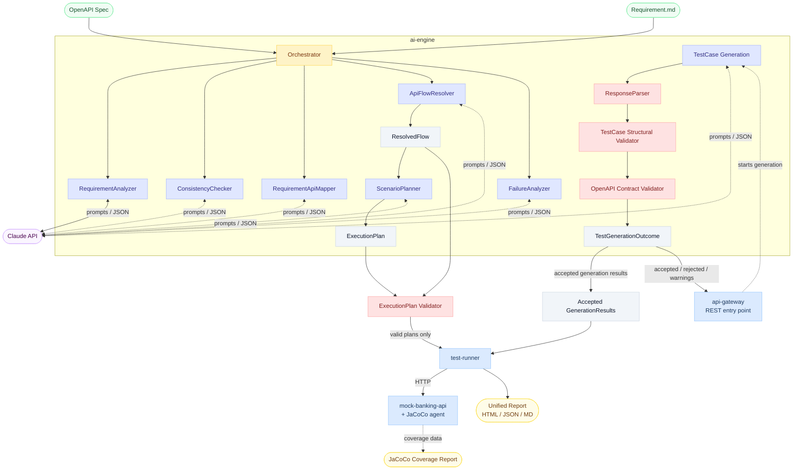

# TestForge AI

> AI-powered test engineering platform that turns OpenAPI specifications and business requirements into validated, executable test suites — with deterministic LLM output validation, consistency checking, multi-step scenarios, and AI-assisted failure diagnosis.


---

## 📊 Live Demo Reports

[](https://meiashley.github.io/testforge-ai/sample-v5-execution-report.html)
[](https://meiashley.github.io/testforge-ai/sample-v4-execution-report.html)
[](https://meiashley.github.io/testforge-ai/sample-execution-report.html)
[](https://meiashley.github.io/testforge-ai/coverage/index.html)

🆕 **V5** combines PRD-driven scenarios + AI-augmented API tests + automatic consistency check between requirements and OpenAPI spec + deterministic pre-execution validation + AI-driven failure diagnosis (categorizes failures into 6 root-cause types).

---

## 🎯 What It Does

Feed in:
- An **OpenAPI specification** (technical contract)
- A **product requirement document** (business intent, Markdown)

The pipeline:
1. Extracts structured business constraints from the requirement.
2. Detects inconsistencies between the requirement and the OpenAPI specification.
3. Generates API-level test cases and multi-step business scenario plans.
4. Applies deterministic structural validation to generated test cases.
5. Applies limited OpenAPI contract checks for endpoint paths, HTTP methods, top-level request body fields, and documented response statuses.
6. Validates each ExecutionPlan against its source ResolvedFlow.
7. Executes only accepted tests and valid plans against a real API.
8. Uses AI to diagnose the root causes of runtime failures.

Results may include accepted tests, rejected generated artifacts, validation warnings, execution results, consistency findings, coverage data, and AI-assisted failure analysis.

---

## 🚀 Iteration Story: V1 → V5

| Version | Test Cases | Pass Rate | What It Proves                                                |
|---------|-----------|-----------|---------------------------------------------------------------|
| V1      | 9          | 55.6%     | Naive baseline, exposed state pollution issues                |
| V3.1    | 9          | **100%**  | Per-test lazy fixtures (narrow scope, reliable)               |
| V4      | 34         | 82.4%     | Dimension-driven generation + AI Failure Analyzer (found real API bug) |
| **V5**  | **34 + 6** | 82.4% / 50% | Requirement-driven pipeline + consistency check + multi-step scenarios |

---

## 🌟 Key Highlights

- 🧠 **Requirement-driven test generation** — AI reads PRD Markdown and extracts 26 structured business constraints.
- 🔍 **Consistency check** — automatically surfaces 23 mismatches between requirement and OpenAPI (e.g., undocumented ownership rules, missing idempotency).
- 🎬 **Multi-step business scenarios** — generates execution plans like "User A pays, User B attempts refund (should be rejected)".
- 🧪 **Deterministic LLM output validation** — validates generated test structure, limited OpenAPI contract checks for paths, methods, documented response statuses, top-level request body fields, ExecutionPlan integrity, bindings, variable dependencies, supported assertions, and other pre-runtime requirements.
- 🛡️ **Fail-closed execution safety** — structurally invalid tests do not reach contract validation or execution; contract-invalid tests do not enter accepted cache or execution; malformed ExecutionPlans are rejected before any HTTP request is sent; generation fails when no accepted test remains.
- 📋 **Structured generation diagnostics** — API Gateway exposes accepted tests, rejected tests, validation warnings, and partial-acceptance status through job results.
- 🤖 **AI Failure Analyzer** — when runtime tests fail, Claude diagnoses root cause across 6 categories (TEST_LOGIC_ERROR / API_BUG / etc.) with confidence labels.
- 💰 **Validation-preserving caching** — warm runs can avoid repeated LLM calls while preserving the same validation gates.
- ✅ **Multi-layer quality controls** — deterministic pre-execution validation, runtime assertions, code coverage, and AI-assisted failure diagnosis.

---

## 🏗️ Architecture


```mermaid
graph TB
    A([OpenAPI Spec]):::input --> O
    R([Requirement.md]):::input --> O

    subgraph AIENGINE[ai-engine]
        O[Orchestrator]:::orch
        O --> RA[RequirementAnalyzer]:::ai
        O --> CC[ConsistencyChecker]:::ai
        O --> MAP[RequirementApiMapper]:::ai
        O --> AFR[ApiFlowResolver]:::ai
        AFR --> RF[ResolvedFlow]:::data
        RF --> SP[ScenarioPlanner]:::ai
        SP --> EP[ExecutionPlan]:::data
        O --> FA[FailureAnalyzer]:::ai

        TG[TestCase Generation]:::ai --> RP[ResponseParser]:::gate
        RP --> TSV[TestCase Structural Validator]:::gate
        TSV --> OCV[OpenAPI Contract Validator]:::gate
        OCV --> TGO[TestGenerationOutcome]:::data
    end

    RA <-->|prompts / JSON| C([Claude API]):::external
    CC <-.->|prompts / JSON| C
    MAP <-.->|prompts / JSON| C
    AFR <-.->|prompts / JSON| C
    SP <-.->|prompts / JSON| C
    FA <-.->|prompts / JSON| C
    TG <-.->|prompts / JSON| C

    RF --> EPV[ExecutionPlan Validator]:::gate
    EP --> EPV
    EPV -->|valid plans only| D[test-runner]:::module
    TGO -->|accepted generation results| AGR[Accepted GenerationResults]:::data
    AGR --> D
    TGO -->|accepted / rejected / warnings| H[api-gateway<br/>REST entry point]:::module
    H -.->|starts generation| TG
    D -->|HTTP| E[mock-banking-api<br/>+ JaCoCo agent]:::module
    D --> F([Unified Report<br/>HTML / JSON / MD]):::output
    E -.->|coverage data| G([JaCoCo Coverage Report]):::output

    classDef module fill:#dbeafe,stroke:#93c5fd,color:#1e3a5f
    classDef ai fill:#e0e7ff,stroke:#a5b4fc,color:#312e81
    classDef orch fill:#fef3c7,stroke:#fcd34d,color:#78350f
    classDef input fill:#f0fdf4,stroke:#86efac,color:#14532d
    classDef output fill:#fefce8,stroke:#fde047,color:#713f12
    classDef external fill:#faf5ff,stroke:#d8b4fe,color:#4a044e
    classDef gate fill:#fee2e2,stroke:#fca5a5,color:#7f1d1d
    classDef data fill:#f1f5f9,stroke:#cbd5e1,color:#0f172a
```

Generated API tests pass through raw response parsing, deterministic structural validation, and OpenAPI contract validation before they are cached as accepted artifacts or executed. Multi-step ExecutionPlans are compared with their source ResolvedFlow before any HTTP request is sent. API Gateway keeps the generation outcome: accepted results, rejected tests, validation warnings, and partial-acceptance information.

See [docs/architecture.md](docs/architecture.md) for module boundary details.

---

## 🧠 V5 AI Pipeline and Deterministic Execution Gate

V5 introduces a 6-stage requirement-driven AI pipeline orchestrated by `QualityPipelineOrchestrator` (pure orchestration, no business logic).

| Stage                      | Component             | What It Does                                                       |
|----------------------------|-----------------------|-------------------------------------------------------------------|
| 1. Requirement understanding | `RequirementAnalyzer` | Extract structured constraints from PRD (value range, state machine, ownership, authorization, workflow) |
| 2. Consistency check       | `ConsistencyChecker`  | Compare requirement vs OpenAPI; surface mismatches with severity + confidence |
| 3. Feature mapping         | `RequirementApiMapper`| Lookup which endpoints serve each business feature                 |
| 4. Workflow design         | `ApiFlowResolver`     | Order endpoints + define `${variable}` data bindings between steps |
| 5. Scenario planning       | `ScenarioPlanner`     | Add business assertions, test data, and expected status codes; produce `ExecutionPlan` |
| 6. Failure diagnosis       | `FailureAnalyzer`     | Batch AI analysis of failed steps (V4 carry-over)                  |

Strict separation of concerns: Mapper finds endpoints, Resolver orders them, Planner adds business logic. Shared state lives in `QualityContext` to prevent parameter sprawl in the orchestrator.

### Deterministic Execution Gate

Before execution, every `ExecutionPlan` is checked against the original `ResolvedFlow`. The validator checks:

- Plan and step completeness.
- One-to-one correspondence with resolved flow steps.
- Step identity and execution list order.
- Immutable method, path template, path bindings, header bindings, role, order, and output capture.
- Supported HTTP methods.
- Supported assertion types.
- Path and header binding structure.
- Initial inputs, `metadata.testData`, and inter-step output captures.
- Unresolved placeholders and forward references.

`ScenarioPlanner` can populate test data, request body, expected status, assertions, and step descriptions. It must not reorder steps or modify the resolved call structure. Any structural plan error rejects the whole plan before an HTTP request is sent.

Output captures support `$.statusCode`, `$.body`, `$.body.<field>`, and `$.headers.<header>`. `expectedStatusCode` validates the current step's HTTP response status; `$.statusCode` captures the actual response status for later step references.

Current ExecutionPlan assertion types are:
- `EQUALS`
- `NOT_EQUALS`
- `EXISTS`
- `NOT_EXISTS`
- `CONTAINS`

---

## 🛡️ Quality Validation

Quality is controlled across deterministic pre-execution gates, runtime checks, and post-execution analysis. Passing rate alone is insufficient.

| Stage | Control | What It Checks |
|---|---|---|
| Parsing | `ResponseParser` | Raw-text cleanup, JSON syntax, deserialization, and conversion to the `TestCase` model |
| Pre-execution | TestCase structural validation | Required fields, supported methods, valid status codes, request/assertion structure, unique IDs, and deterministic duplicate content |
| Pre-execution | OpenAPI contract validation | Endpoint path and method alignment, request body top-level fields, and documented response status codes |
| Pre-execution | ExecutionPlan validation | Resolved-flow integrity, step completeness and order, bindings, variable dependencies, supported assertions, and unresolved references |
| Runtime | HTTP execution and assertions | Actual response status, body values, headers, and multi-step workflow behaviour |
| Post-execution | JaCoCo coverage | Whether generated tests exercise the implementation |
| Post-execution | AI Failure Analyzer | Whether failures are caused by test logic, API behaviour, data, assertions, or environment |

### Fail-Closed Behaviour

The validation policy is fail-closed:

- Invalid JSON rejects the full LLM response.
- Duplicate test-case IDs reject the generated batch.
- A structurally invalid individual test is rejected and does not enter OpenAPI contract validation or execution.
- Warning-only test cases remain accepted, except `DUPLICATE_EXECUTION_CONTENT`, which rejects the later duplicate while preserving the first occurrence.
- Contract-invalid tests do not enter accepted results, accepted cache, or execution.
- A batch-level structural failure, such as duplicate test-case IDs or a batch with no structurally valid tests, aborts the generation run before execution while preserving diagnostics accumulated so far.
- A malformed ExecutionPlan is rejected before any HTTP request is sent.
- A generation run with no accepted tests fails and preserves structured diagnostics.
- Invalid artifacts are not silently deleted; rejected items and warnings are returned through `TestGenerationOutcome`.

### Partial Acceptance

When generation completes without a batch-level structural failure, a run can contain both accepted and rejected tests. Only accepted tests are executed. Rejected tests and warnings are returned through `TestGenerationOutcome`.

In API Gateway jobs, `partialAcceptance` is `true` when accepted and rejected items exist in the same run. A failed job may still preserve accepted results accumulated before the failure, but generation-validation failures abort execution.

### V3.1 Detailed Metrics

| Metric                | Value         |
|-----------------------|---------------|
| Pass rate             | **100%** (9/9) |
| Line coverage         | **82.6%**     |
| Branch coverage       | **60.0%**     |
| Contract violations   | **0**         |

### V4 Detailed Metrics

| Metric              | Value         |
|---------------------|---------------|
| Test cases          | 34 (vs V3.1 9) |
| Pass rate           | 82.4% (28/34) |
| AI diagnoses        | 6 (HIGH confidence) |
| Real bug found      | 1 (refund idempotency) |

### V5 Detailed Metrics

| Metric                       | Value          |
|------------------------------|----------------|
| Constraints extracted        | **26**         |
| Scenarios identified         | 6              |
| Mismatches detected          | **23**         |
| API tests (incl. V4 layer)   | 34 (28 pass)   |
| Multi-step scenarios         | 6 (3 pass)     |
| AI failure diagnoses         | 9              |
| — categorized as             | 3 API_BUG / 5 TEST_LOGIC_ERROR / 1 ASSERTION_TOO_STRICT |

---

## 🤖 AI Failure Analyzer

When tests fail, the system sends a batch request to Claude (one call diagnoses all failures) and gets back structured root causes.

**Categories**
- `TEST_LOGIC_ERROR` — Test expectations don't match the spec
- `API_BUG` — API behaves incorrectly per the spec
- `DATA_DEPENDENCY` — Required prerequisite data missing or in wrong state
- `ASSERTION_TOO_STRICT` — Assertions check fields not actually required
- `ENVIRONMENT` — Network/timeout/infrastructure
- `UNCERTAIN` — Multiple plausible causes; needs human review

**V5 baseline diagnosis breakdown (9 failures analyzed)**

| Category               | Count | Note                                                  |
|------------------------|-------|-------------------------------------------------------|
| `API_BUG`              | **3** | Real defects in `mock-banking-api`                    |
| `TEST_LOGIC_ERROR`     | 5     | AI-generated test expectations not aligning with spec |
| `ASSERTION_TOO_STRICT` | 1     | Assertion checks a field not actually required        |

The AI flagged **3 real production-relevant defects** in `mock-banking-api`, including the V4-discovered refund idempotency gap (refunding an already-REFUNDED payment returns 200 instead of 422) plus 2 additional bugs surfaced by V5 multi-step scenarios.

Each diagnosis includes: category, summary, evidence (specific data points from response), suggested fix, and confidence label. Results render inline in failed test rows in the HTML report.

---

## ⚙️ REST API and Generation Outcome

The current API gateway exposes the API-level test generation flow as an asynchronous REST API for CI/CD integration. Full V5 requirement-driven workflow exposure remains on the roadmap.

```bash
# Start the gateway
mvn spring-boot:run -pl api-gateway

# Submit a generation job
curl -X POST http://localhost:8080/api/v1/generate-tests \
  -H "Content-Type: application/json" \
  -d '{
    "openApiUrl": "https://example.com/openapi.yaml",
    "promptVersion": "V3.1"
  }'

# Poll for results
curl http://localhost:8080/api/v1/jobs/{jobId}
```

Supported prompt versions are `V1`, `V2`, `V3`, and `V3.1`. The default is `V3.1`.

Generation jobs run asynchronously and can be polled through the job endpoint. Swagger UI is available at `http://localhost:8080/swagger-ui.html` after startup.

### Generation Outcome

| Field | Meaning |
|---|---|
| `generationResults` | Accepted generated tests grouped by endpoint |
| `rejectedTestCases` | Structurally invalid, duplicate, or OpenAPI contract-invalid generated tests |
| `validationWarnings` | Warning-severity diagnostics; most are non-blocking, while duplicate-content warnings reject the later duplicate |
| `partialAcceptance` | `true` when accepted and rejected tests exist in the same run |
| `report` | Runtime execution report for accepted tests |
| `errorMessage` | Pipeline or execution failure summary |

Rejected diagnostics can include the original batch index, `testCaseId` when available, stable error code, deterministic field path, human-readable message, and severity.

A failed Job can preserve accepted results accumulated before the failure, rejected tests, and validation warnings. Generation-validation failures abort execution. For a successful generation outcome, only accepted tests enter execution.

Example shape:

```json
{
  "jobId": "job-123",
  "status": "FAILED",
  "generationResults": [],
  "rejectedTestCases": [
    {
      "batchIndex": 0,
      "testCaseId": "tc-invalid",
      "validationIssues": [
        {
          "code": "STATUS_NOT_IN_SPEC",
          "fieldPath": "testCases[0].expected.status",
          "message": "Expected status is not documented for this endpoint",
          "severity": "ERROR"
        }
      ]
    }
  ],
  "validationWarnings": [],
  "partialAcceptance": false,
  "errorMessage": "Generated tests were rejected by validation"
}
```

---

## 🚀 Quick Start

```bash
# Build everything
mvn install -DskipTests

# Run V3.1 baseline (requires ANTHROPIC_API_KEY env var)
mvn test -pl test-runner -Dtest=V3BaselinePipelineTest

# Run V4 baseline (34 cases, dimension-driven)
mvn test -pl test-runner -Dtest=V4BaselinePipelineTest

# Run V5 pipeline (requirement + API + scenarios)
mvn test -pl test-runner -Dtest=V5BaselinePipelineTest

# Run V5 pipeline and enrich the unified report with JaCoCo coverage
mvn -P v5-with-coverage -pl test-runner -am \
  -Dtest=com.testforge.runner.V5BaselinePipelineTest \
  -Dsurefire.failIfNoSpecifiedTests=false \
  verify --batch-mode

# View HTML report
open test-runner/target/v5-execution-report.html
```

### V5 Coverage Report

The V5 coverage profile uses JaCoCo to measure the target API module, `mock-banking-api`, during generated-test execution. It does not report whole-project TestForge coverage.

The unified report is written in two phases:

1. V5 execution writes `test-runner/target/v5-execution-report.json`, `.html`, and `.md` with coverage status `PENDING`. Summary cards for Line Coverage and Branch Coverage display `-`.
2. After the test JVM exits, JaCoCo writes a dedicated exec file at `test-runner/target/coverage/jacoco-v5.exec`, generates XML/CSV/full HTML detail output under `test-runner/target/coverage/jacoco/`, parses `jacoco.xml`, and rewrites the same unified report paths.

Refresh `test-runner/target/v5-execution-report.html` after the Maven command completes to see the latest Line and Branch coverage. The coverage section links to the detailed JaCoCo report at `coverage/jacoco/index.html`. If coverage data is unavailable or fails to parse, the unified report keeps the test results and displays `-` instead of `0%`.

---

## 💾 Caching

### Raw LLM response cache

`RealClaudeClient` caches raw LLM text by model and prompt fingerprint. A raw cache hit is still parsed and must pass deterministic validation before becoming an accepted artifact. The cache hit revalidation step ensures cached raw output cannot bypass validators.

### Accepted endpoint test cache

`EndpointCache` stores accepted endpoint-level `TestCase` lists by prompt fingerprint. Only non-empty tests that pass structural validation and OpenAPI contract validation are saved as accepted artifacts. Structurally invalid and contract-invalid tests are not cached as accepted results.

Cache hits are still revalidated through structural and contract checks. Warm runs can avoid repeated LLM calls while preserving the same validation gates.

---

## 🗺️ Roadmap

- [x] V1 → V3.1: iterative reliability and pass-rate improvements
- [x] V4: dimension-driven API test generation
- [x] AI Failure Analyzer with batch root-cause diagnosis
- [x] JaCoCo coverage integration
- [x] Generated TestCase structural validation
- [x] OpenAPI contract validation with structured rejection diagnostics
- [x] Flow-aware ExecutionPlan validation
- [x] Fail-closed generation and execution semantics
- [x] API Gateway outcome fields for accepted results, rejected tests, warnings, and partial acceptance
- [x] Architecture diagram and plugin-pattern reporting
- [x] V5: requirement-driven pipeline with consistency checking and scenario execution
- [x] Embed JaCoCo metrics directly into the unified execution report
- [ ] Expose the complete V5 workflow through `api-gateway`
- [ ] Add requirement-to-test provenance and traceability
- [ ] Build an offline golden evaluation suite
- [ ] Extend OpenAPI validation to nested schemas, required fields, data types, enums, constraints, and response bodies
- [ ] Add mutation testing to measure generated-test defect-detection power
- [ ] Support multi-spec batch processing in CI

---

## 📜 License

MIT
